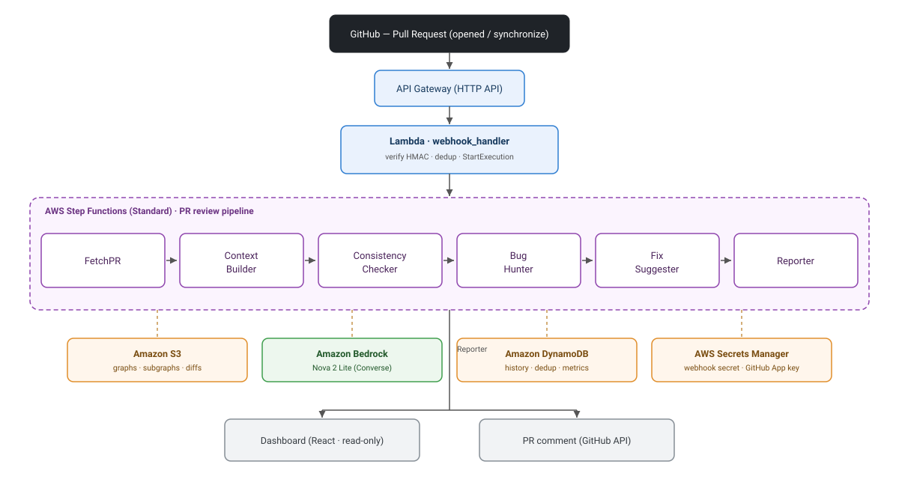

# Arcus

**Autonomous Pull Request review powered by a multi-agent system with persistent repository context.**

[Español](README.md) · **English**


Arcus is a serverless pipeline that, when a Pull Request is opened or updated on a GitHub
repository where the Arcus GitHub App is installed, runs a chain of specialized agents on
AWS and posts a comment on the PR with architectural inconsistencies, potential bugs, and
suggested fixes. Unlike a linter that only sees the isolated diff, Arcus maintains a
**persistent context graph** of the repository (modules, symbols, dependencies, and
conventions) and analyzes each change against the real neighborhood of the code, reducing
false positives and model hallucinations.

---

## The problem it solves

Traditional automated code reviews analyze the diff without knowing the rest of the
repository, so they miss issues that are only evident with context (for example, breaking
an established convention or the project's error-handling pattern). Arcus builds and
persists a map of the repository, extracts the subgraph relevant to the changed files, and
uses it so each agent reasons with the bounded context of the change.

---

## Architecture and components

Arcus is a **linear orchestration on AWS Step Functions** triggered by a GitHub webhook. A
single JSON object (the `PipelineEnvelope`) travels from state to state; each Lambda reads
what it needs and appends its own section without overwriting the others' work. Heavy data
(graph, subgraph, diff) travels **by S3 reference** to respect the 256 KB Step Functions
payload limit.

<p align="center">
  
</p>

<details>
<summary>View the flow as text</summary>

```
                       PR event (opened / synchronize)
                                │  signed HTTPS webhook (HMAC-SHA256)
                                ▼
        API Gateway (HTTP API)  ──►  Lambda webhook_handler
                                        │ 1. verify HMAC signature
                                        │ 2. filter the event action
                                        │ 3. dedup by (repo, pr, sha)
                                        │ 4. StartExecution(Step Functions)
                                        ▼
   ┌──────────────────── Step Functions (Standard) ────────────────────┐
   │                                                                    │
   │  FetchPR ─► ContextBuilder ─► ConsistencyChecker ─► BugHunter ─►   │
   │                                              FixSuggester ─► Reporter
   │       │                                                            │
   │  (diff → S3)     (context graph ↔ S3)          (GitHub API + DynamoDB)
   └────────────────────────────────────────────────────────────────────┘
                                │
                                ▼
        PR comment  +  DynamoDB row  ──►  Dashboard (React, read-only)
```

</details>

### Components

| Component | AWS service | Responsibility |
|---|---|---|
| **Ingress** | API Gateway (HTTP API) + Lambda | Receives the webhook, verifies the HMAC signature, applies dedup, and starts the execution. Responds 202 quickly. |
| **Orchestration** | Step Functions (Standard) | Chains the states in sequence with `Retry`/`Catch` for graceful degradation. |
| **FetchPR** | Lambda | Downloads the diff and the list of changed files and stores them in S3. |
| **Context Builder** | Lambda | Parses Python with tree-sitter, builds/updates the graph (networkx) in S3, and extracts the relevant subgraph. |
| **Consistency Checker** | Lambda + Bedrock | Compares the diff against detected conventions; produces inconsistency findings. |
| **Bug Hunter** | Lambda + Bedrock | Detects logic and security bugs using the context subgraph. |
| **Fix Suggester** | Lambda + Bedrock | Enriches existing findings with a `fix` and a `suggested_diff`. |
| **Reporter** | Lambda + GitHub API + DynamoDB | Renders the Markdown comment, posts/updates it on the PR, and persists the history. |
| **Context** | S3 | Repo graphs, subgraphs, and PR diffs. |
| **History / dedup** | DynamoDB (single-table) | Review records, metrics, and idempotency markers. |
| **Secrets** | Secrets Manager | Webhook secret and GitHub App private key. |
| **Dashboard** | React SPA (read-only) | Consumes the persisted metrics; never writes. |

### Agent contract

Every piece of data that crosses an agent boundary is a **Pydantic** model defined in
`src/arcus/contracts/` (`PipelineEnvelope`, `Finding`, `RepoGraph`). The envelope is the
single shared interface across work streams, which allows developing the agents in parallel
against fixtures without depending on one another.

### Resilience

The failure of an intermediate agent **does not bring down the pipeline**: the agent
catches its exception, marks its section as `status: "failed"`, and returns the envelope so
the next one continues. If the Context Builder fails to build a graph, the agents run in
"diff-only mode" and the report notes it. The Reporter always runs and indicates which
stages did not complete. Writes (PR comment, DynamoDB row) are idempotent across retries.

---

## Technologies and stack

**Backend / infrastructure**
- **Python 3.12** — agent logic and Lambda handlers.
- **AWS SAM** (Serverless Application Model) — infrastructure as code.
- **AWS Lambda, Step Functions (Standard), API Gateway (HTTP API), S3, DynamoDB, Secrets Manager, CloudWatch, SNS.**
- **Amazon Bedrock** — Amazon Nova 2 Lite via the **Converse** API (configurable `BEDROCK_MODEL_ID`).
- **Pydantic v2** — data contracts and validation at the boundary.
- **tree-sitter** (Python parser) + **networkx** — context graph construction.
- **uv** — dependency and environment management (`pyproject.toml` + `uv.lock`).
- **ruff** (format + lint) and **mypy** (strict typing in key modules).

**Testing**
- **pytest** + **pytest-mock**, **moto** (S3/DynamoDB mocks), **responses** (GitHub API mocks). Bedrock is always mocked in CI.

**Dashboard**
- **React 18 + Vite 5 + TypeScript + Tailwind CSS + Recharts** (read-only SPA). Its own docs live in [`dashboard/README.en.md`](dashboard/README.en.md) ([Español](dashboard/README.md)).

---

## Project structure

```
arcus/
├── infra/                      # IaC with AWS SAM
│   ├── template.yaml           # Resources: Lambdas, Step Functions, API GW, IAM, S3, DynamoDB
│   ├── statemachine/
│   │   └── pipeline.asl.json   # State machine definition (Amazon States Language)
│   ├── env/                    # Per-environment parameters (dev.json, demo.json)
│   ├── stubs/                  # Placeholder handlers for stages still in development
│   ├── samconfig.toml.example  # Per-environment deploy parameters (non-secret)
│   └── README.md               # Infrastructure-specific notes
│
├── src/arcus/
│   ├── contracts/              # Shared Pydantic models (envelope, findings, graph)
│   ├── agents/                 # One Lambda handler per agent + BaseAgent
│   ├── bedrock/                # Bedrock Converse client (retry/backoff) + prompts
│   ├── graph/                  # Graph build, persistence, and query (tree-sitter → networkx)
│   ├── github/                 # Webhook verification, GitHub App auth, API client
│   ├── storage/                # DynamoDB access (history and metrics)
│   ├── entrypoints/            # Thin handlers (webhook, fetch_pr)
│   ├── config.py               # Configuration loading from environment variables
│   └── logging.py              # Structured JSON logging
│
├── dashboard/                  # React + Vite SPA (read-only) — see dashboard/README.en.md
├── docs/                       # Diagrams (architecture.svg / architecture.en.svg)
├── tests/
│   ├── unit/                   # Pure, deterministic logic
│   ├── integration/            # Critical seams (moto, responses)
│   └── fixtures/               # Sample envelopes, graphs, PRs, and webhooks
├── scripts/                    # Local utilities (seed_graph.py, replay_webhook.py)
├── .github/workflows/ci.yml    # CI: dashboard build + backend checks
├── requirements.txt            # Runtime dependencies for SAM packaging (generated from uv.lock)
├── pyproject.toml              # Project, dependencies, and tooling configuration
├── uv.lock                     # Versioned lockfile for reproducible builds
├── samconfig.toml              # Local SAM deployment configuration
└── README.md · README.en.md    # This document (Spanish / English)
```

**Organization principles**
- `contracts/` is the source of truth: no loose dictionaries crossing boundaries.
- Handlers in `entrypoints/` and `agents/` are thin; testable logic lives in `graph/`,
  `github/`, `bedrock/`, `storage/`.
- The `dashboard/` is read-only and does not block the backend.
- `infra/` is owned by a single work stream to avoid conflicts on the state machine.

---

## Prerequisites

- **An AWS account** with permissions to create Lambda, Step Functions, API Gateway, S3, DynamoDB, IAM, Secrets Manager, CloudWatch, and SNS.
- **Amazon Bedrock model access** (Amazon Nova 2 Lite) enabled in the deployment region (default `us-east-1`). Without this access, the analysis agents will fail at runtime.
- **AWS CLI** configured with credentials and region (`aws configure`).
- **AWS SAM CLI** (for `sam build` / `sam deploy`).
- **Python 3.12**.
- **uv** — to manage the development environment and regenerate dependencies.
- **Docker** — optional, only needed for `sam local invoke` / container builds.
- A **GitHub App** installed on the repositories to review (with read access to PRs and write access to comments) and a webhook secret.

---

## Deployment guide

All commands run from the project root.

### 1. Prepare the development environment

```bash
uv sync --dev
```

### 2. Runtime dependencies for packaging

The Lambda packaging uses the standard Python packager (pip), which reads `requirements.txt`.
This file is **generated from `uv.lock`** (not hand-edited) so the bundle stays faithful to
the lockfile:

```bash
uv export --locked --no-dev --no-emit-project --no-hashes -o requirements.txt
```

### 3. Build

```bash
sam build -t infra/template.yaml
```

### 4. Deploy

The first time, use guided mode to generate your `samconfig.toml` (you can start from
`infra/samconfig.toml.example`):

```bash
sam deploy --guided
```

For subsequent deploys:

```bash
sam deploy
```

**Useful stack parameters** (defined in `infra/template.yaml`):
- `Environment` — `dev` or `demo`.
- `BedrockModelId` — Bedrock model id (default `us.amazon.nova-2-lite-v1:0`).

> Physical resource names are generated automatically by CloudFormation, so you can deploy
> multiple stacks without name collisions.

### 5. Post-deployment configuration

1. **Populate the secrets** in AWS Secrets Manager (created empty on purpose):
   - the GitHub **webhook secret**, and
   - the GitHub App **PEM private key**.
   The corresponding ARNs appear in the stack *Outputs*.
2. **Verify Bedrock model access** in the deployment region.
3. **Configure the GitHub App webhook** with the published URL (see below).

---

## Webhook integration (GitHub)

On deploy, the stack exposes the endpoint URL in the **`WebhookUrl`** output (something like
`https://{api-id}.execute-api.{region}.amazonaws.com/webhook`).

In your **GitHub App** configuration:

- **Payload URL:** the stack's `WebhookUrl`.
- **Content type:** `application/json`.
- **Secret:** the same value you stored in Secrets Manager as the webhook secret.
- **Events:** *Pull requests* (Arcus processes the `opened` and `synchronize` actions).

Every request is validated with **HMAC-SHA256** over the `X-Hub-Signature-256` header before
the body is processed; without a valid signature the endpoint responds `401`. Events that
are not of interest (for example the `ping` verification GitHub sends when configuring the
webhook, or other PR actions) are answered immediately without starting the pipeline. The
endpoint is public by design (GitHub must be able to reach it); the real authentication is
the HMAC signature.

---

## Development and testing

```bash
uv run pytest tests/unit           # fast, on every commit
uv run pytest tests/integration    # before merging to main
uv run pytest -m contract          # agent contract tests
uv run ruff check --fix            # format + lint
uv run mypy src/arcus              # typing
```

The testing strategy prioritizes protecting the demo flow: each agent's **contract tests**
(which consume a fixture envelope and validate the output against the Pydantic model) are
non-negotiable, because the envelope is the integration point across work streams. The LLM
is always mocked in CI and the tests verify *parsing* and *flow*, never the model's exact
text.

### Continuous integration

The GitHub Actions workflow (`.github/workflows/ci.yml`) runs on every push and pull
request with two jobs:

- **Dashboard** — `npm ci` + `npm run build` (Node.js 20).
- **Backend** — `uv sync --locked --dev`, `ruff format --check`, `ruff check`, `mypy` over
  the boundary modules (`contracts`, `graph`, `github`), unit / contract / integration
  tests, `uv build`, and finally `sam validate --lint` + `sam build` of the template.
