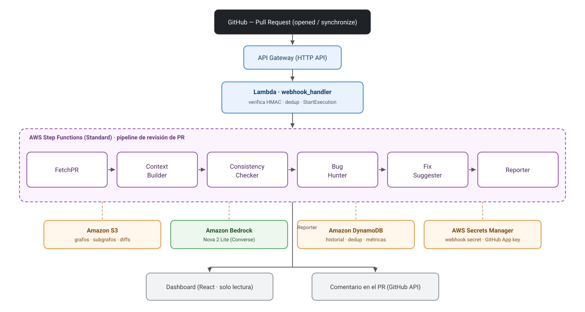

# Arcus

**Revisión autónoma de Pull Requests con un sistema multiagente y contexto persistente del repositorio.**

**Español** · [English](README.en.md)


Arcus es un pipeline serverless que, cuando se abre o actualiza un Pull Request en un
repositorio de GitHub, ejecuta una cadena de agentes especializados sobre AWS y publica en
el PR un comentario con inconsistencias arquitectónicas, bugs potenciales y fixes
sugeridos. A diferencia de un linter que solo ve el diff aislado, Arcus mantiene un **grafo
de contexto persistente** del repositorio (módulos, símbolos, dependencias y convenciones)
y analiza cada cambio contra el vecindario real del código, reduciendo falsos positivos y
alucinaciones del modelo.

---

## El problema que resuelve

Las revisiones de código automáticas tradicionales analizan el diff sin conocer el resto
del repositorio, así que pierden problemas que solo son evidentes con contexto (por
ejemplo, romper una convención establecida o un patrón de manejo de errores del proyecto).
Arcus construye y persiste un mapa del repositorio, extrae el subgrafo relevante a los
archivos cambiados y lo usa para que cada agente razone con el contexto acotado del cambio.

---

## Arquitectura y componentes

Arcus es una **orquestación lineal en AWS Step Functions** disparada por un webhook de
GitHub. Un único objeto JSON (el `PipelineEnvelope`) viaja de estado en estado; cada Lambda
lee lo que necesita y anexa su sección sin sobrescribir el trabajo de las demás. Los datos
pesados (grafo, subgrafo, diff) viajan **por referencia a S3** para respetar el límite de
256 KB de payload de Step Functions.

<p align="center">
  
</p>

<details>
<summary>Ver el flujo en texto</summary>

```
                    Evento de PR (opened / synchronize)
                                │  webhook HTTPS firmado (HMAC-SHA256)
                                ▼
        API Gateway (HTTP API)  ──►  Lambda webhook_handler
                                        │ 1. verifica firma HMAC
                                        │ 2. filtra la acción del evento
                                        │ 3. dedup por (repo, pr, sha)
                                        │ 4. StartExecution(Step Functions)
                                        ▼
   ┌──────────────────── Step Functions (Standard) ────────────────────┐
   │                                                                    │
   │  FetchPR ─► ContextBuilder ─► ConsistencyChecker ─► BugHunter ─►   │
   │                                              FixSuggester ─► Reporter
   │       │                                                            │
   │  (diff → S3)     (grafo de contexto ↔ S3)      (GitHub API + DynamoDB)
   └────────────────────────────────────────────────────────────────────┘
                                │
                                ▼
        Comentario en el PR  +  fila en DynamoDB  ──►  Dashboard (React, solo lectura)
```

</details>

### Componentes

| Componente | Servicio AWS | Responsabilidad |
|---|---|---|
| **Ingreso** | API Gateway (HTTP API) + Lambda | Recibe el webhook, verifica la firma HMAC, aplica dedup e inicia la ejecución. Responde 202 rápido. |
| **Orquestación** | Step Functions (Standard) | Encadena los estados en secuencia con `Retry`/`Catch` para degradación elegante. |
| **FetchPR** | Lambda | Descarga el diff y la lista de archivos cambiados y los guarda en S3. |
| **Context Builder** | Lambda | Parsea Python con tree-sitter, construye/actualiza el grafo (networkx) en S3 y extrae el subgrafo relevante. |
| **Consistency Checker** | Lambda + Bedrock | Compara el diff contra las convenciones detectadas; produce findings de inconsistencia. |
| **Bug Hunter** | Lambda + Bedrock | Detecta bugs lógicos y de seguridad usando el subgrafo de contexto. |
| **Fix Suggester** | Lambda + Bedrock | Enriquece los findings existentes con un `fix` y un `suggested_diff`. |
| **Reporter** | Lambda + GitHub API + DynamoDB | Renderiza el comentario Markdown, lo publica/actualiza en el PR y persiste el historial. |
| **Contexto** | S3 | Grafos del repo, subgrafos y diffs de PR. |
| **Historial / dedup** | DynamoDB (single-table) | Registro de revisiones, métricas y marcas de idempotencia. |
| **Secretos** | Secrets Manager | Webhook secret y clave privada de la GitHub App. |
| **Dashboard** | React SPA (solo lectura) | Consume las métricas persistidas; nunca escribe. |

### Contrato entre agentes

Todo dato que cruza el límite de un agente es un modelo **Pydantic** definido en
`src/arcus/contracts/` (`PipelineEnvelope`, `Finding`, `RepoGraph`). El envelope es la única
interfaz compartida entre frentes de trabajo, lo que permite desarrollar los agentes en
paralelo contra fixtures sin depender unos de otros.

### Resiliencia

El fallo de un agente intermedio **no tumba el pipeline**: el agente atrapa su excepción,
marca su sección como `status: "failed"` y devuelve el envelope para que el siguiente
continúe. Si el Context Builder no logra un grafo, los agentes operan en "modo diff-only" y
el reporte lo señala. El Reporter siempre se ejecuta e indica qué etapas no completaron.
Las escrituras (comentario en el PR, fila en DynamoDB) son idempotentes ante reintentos.

---

## Tecnologías y stack

**Backend / infraestructura**
- **Python 3.12** — lógica de agentes y handlers Lambda.
- **AWS SAM** (Serverless Application Model) — infraestructura como código.
- **AWS Lambda, Step Functions (Standard), API Gateway (HTTP API), S3, DynamoDB, Secrets Manager, CloudWatch, SNS.**
- **Amazon Bedrock** — modelo Amazon Nova 2 Lite vía la API **Converse** (`BEDROCK_MODEL_ID` configurable).
- **Pydantic v2** — contratos de datos y validación en el borde.
- **tree-sitter** (parser de Python) + **networkx** — construcción del grafo de contexto.
- **uv** — gestión de dependencias y entornos (`pyproject.toml` + `uv.lock`).
- **ruff** (formato + lint) y **mypy** (tipado estricto en módulos clave).

**Testing**
- **pytest** + **pytest-mock**, **moto** (mock de S3/DynamoDB), **responses** (mock de la GitHub API). Bedrock siempre mockeado en CI.

**Dashboard**
- **React 18 + Vite 5 + TypeScript + Tailwind CSS + Recharts** (SPA de solo lectura). Documentación propia en [`dashboard/README.md`](dashboard/README.md) ([English](dashboard/README.en.md)).

---

## Estructura del proyecto

```
arcus/
├── infra/                      # IaC con AWS SAM
│   ├── template.yaml           # Recursos: Lambdas, Step Functions, API GW, IAM, S3, DynamoDB
│   ├── statemachine/
│   │   └── pipeline.asl.json   # Definición de la máquina de estados (Amazon States Language)
│   ├── env/                    # Parámetros por entorno (dev.json, demo.json)
│   ├── stubs/                  # Handlers de relleno para etapas aún en desarrollo
│   ├── samconfig.toml.example  # Parámetros de despliegue por entorno (no secretos)
│   └── README.md               # Notas específicas de infraestructura
│
├── src/arcus/
│   ├── contracts/              # Modelos Pydantic compartidos (envelope, findings, graph)
│   ├── agents/                 # Un handler Lambda por agente + BaseAgent
│   ├── bedrock/                # Cliente Bedrock Converse (retry/backoff) + prompts
│   ├── graph/                  # Construcción, persistencia y consulta del grafo (tree-sitter → networkx)
│   ├── github/                 # Verificación de webhook, auth de GitHub App, cliente de la API
│   ├── storage/                # Acceso a DynamoDB (historial y métricas)
│   ├── entrypoints/            # Handlers "delgados" (webhook, fetch_pr)
│   ├── config.py               # Carga de configuración desde variables de entorno
│   └── logging.py              # Logging estructurado JSON
│
├── dashboard/                  # SPA React + Vite (solo lectura) — ver dashboard/README.md
├── docs/                       # Diagramas (architecture.svg / architecture.en.svg)
├── tests/
│   ├── unit/                   # Lógica pura y determinista
│   ├── integration/            # Costuras críticas (moto, responses)
│   └── fixtures/               # Envelopes, grafos, PRs y webhooks de ejemplo
├── scripts/                    # Utilidades locales (seed_graph.py, replay_webhook.py)
├── .github/workflows/ci.yml    # CI: build del dashboard + checks del backend
├── requirements.txt            # Dependencias de runtime para el empaquetado SAM (generado desde uv.lock)
├── pyproject.toml              # Proyecto, dependencias y configuración de tooling
├── uv.lock                     # Lockfile versionado para builds reproducibles
├── samconfig.toml              # Configuración local de despliegue SAM
└── README.md · README.en.md    # Este documento (español / inglés)
```

**Principios de organización**
- `contracts/` es la fuente de verdad: nada de diccionarios sueltos cruzando límites.
- Los handlers de `entrypoints/` y `agents/` son delgados; la lógica testeable vive en
  `graph/`, `github/`, `bedrock/`, `storage/`.
- El `dashboard/` es de solo lectura y no bloquea al backend.
- `infra/` es propiedad de un único frente para evitar conflictos en la state machine.

---

## Requisitos previos

- **Cuenta de AWS** con permisos para crear Lambda, Step Functions, API Gateway, S3, DynamoDB, IAM, Secrets Manager, CloudWatch y SNS.
- **Acceso al modelo de Amazon Bedrock** (Amazon Nova 2 Lite) habilitado en la región de despliegue (por defecto `us-east-1`). Sin este acceso, los agentes de análisis fallarán en runtime.
- **AWS CLI** configurado con credenciales y región (`aws configure`).
- **AWS SAM CLI** (para `sam build` / `sam deploy`).
- **Python 3.12**.
- **uv** — para gestionar el entorno de desarrollo y regenerar dependencias.
- **Docker** — opcional, solo necesario para `sam local invoke` / builds en contenedor.
- Una **GitHub App** instalada en los repositorios a revisar (con permiso de lectura de PRs y escritura de comentarios) y un webhook secret.

---

## Guía de despliegue

Todos los comandos se ejecutan desde la raíz del proyecto.

### 1. Preparar el entorno de desarrollo

```bash
uv sync --dev
```

### 2. Dependencias de runtime para el empaquetado

El empaquetado de las Lambdas usa el packager estándar de Python (pip), que lee
`requirements.txt`. Este archivo se **genera desde `uv.lock`** (no se edita a mano) para que
el bundle sea fiel al lockfile:

```bash
uv export --locked --no-dev --no-emit-project --no-hashes -o requirements.txt
```

### 3. Construir

```bash
sam build -t infra/template.yaml
```

### 4. Desplegar

La primera vez, usa el modo guiado para generar tu `samconfig.toml` (puedes partir de
`infra/samconfig.toml.example`):

```bash
sam deploy --guided
```

En despliegues posteriores basta con:

```bash
sam deploy
```

**Parámetros útiles del stack** (definidos en `infra/template.yaml`):
- `Environment` — `dev` o `demo`.
- `BedrockModelId` — id del modelo Bedrock (por defecto `us.amazon.nova-2-lite-v1:0`).

> Los nombres físicos de los recursos se generan automáticamente por CloudFormation, de
> modo que puedes desplegar varios stacks sin colisiones de nombres.

### 5. Configuración posterior al despliegue

1. **Poblar los secretos** en AWS Secrets Manager (se crean vacíos a propósito):
   - el **webhook secret** de GitHub, y
   - la **clave privada PEM** de la GitHub App.
   Los ARNs correspondientes aparecen en los *Outputs* del stack.
2. **Verificar el acceso al modelo Bedrock** en la región de despliegue.
3. **Configurar el webhook de la GitHub App** con la URL publicada (ver abajo).

---

## Integración de webhooks (GitHub)

Al desplegar, el stack expone la URL del endpoint en el output **`WebhookUrl`**
(algo como `https://{api-id}.execute-api.{region}.amazonaws.com/webhook`).

En la configuración de tu **GitHub App**:

- **Payload URL:** la `WebhookUrl` del stack.
- **Content type:** `application/json`.
- **Secret:** el mismo valor que guardaste en Secrets Manager como webhook secret.
- **Eventos:** *Pull requests* (Arcus procesa las acciones `opened` y `synchronize`).

Cada request se valida con **HMAC-SHA256** sobre la cabecera `X-Hub-Signature-256` antes de
procesar el cuerpo; sin firma válida el endpoint responde `401`. Los eventos que no
interesan (por ejemplo el `ping` de verificación que GitHub envía al configurar el webhook,
u otras acciones de PR) se responden de inmediato sin iniciar el pipeline. El endpoint es
público por diseño (GitHub debe poder alcanzarlo); la autenticación real es la firma HMAC.

---

## Desarrollo y pruebas

```bash
uv run pytest tests/unit           # rápido, en cada commit
uv run pytest tests/integration    # antes de merge a main
uv run pytest -m contract          # tests de contrato de los agentes
uv run ruff check --fix            # formato + lint
uv run mypy src/arcus              # tipado
```

La estrategia de testing prioriza proteger el flujo de la demo: los **tests de contrato de
cada agente** (que consumen un envelope de fixture y validan el de salida contra el modelo
Pydantic) son innegociables, porque el envelope es el punto de integración entre frentes.
El LLM se mockea siempre en CI y las pruebas verifican el *parsing* y el *flujo*, nunca el
texto exacto del modelo.

### Integración continua

El workflow de GitHub Actions (`.github/workflows/ci.yml`) se ejecuta en cada push y pull
request con dos jobs:

- **Dashboard** — `npm ci` + `npm run build` (Node.js 20).
- **Backend** — `uv sync --locked --dev`, `ruff format --check`, `ruff check`, `mypy` sobre
  los módulos de borde (`contracts`, `graph`, `github`), tests unitarios, de contrato e de
  integración, `uv build`, y finalmente `sam validate --lint` + `sam build` de la plantilla.
